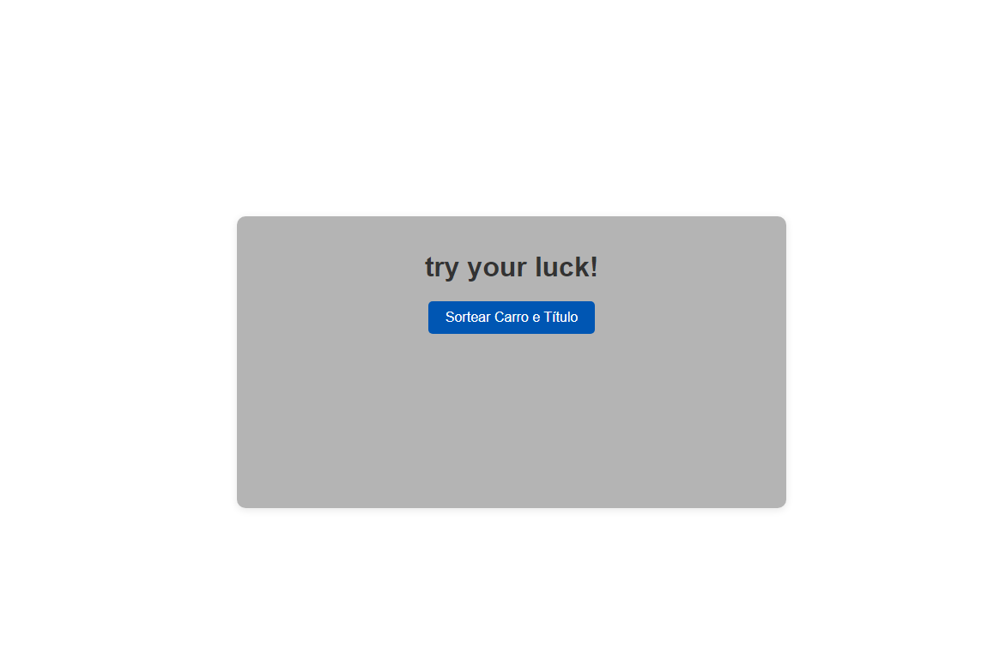

# Sistema de Sorteio de Carro e Título

## Descrição

Este é um sistema simples de sorteio que gera um título e um carro aleatoriamente quando o botão "Sortear Carro e Título" é clicado. É uma maneira divertida de interagir e ver o que a sorte pode trazer!

## Como Funciona

1. **Interface do Usuário**: A interface é composta por um botão centralizado que permite ao usuário iniciar o sorteio.
2. **Sorteio**: Ao clicar no botão "Sortear Carro e Título", o sistema executa uma função que seleciona aleatoriamente um carro e um título.
3. **Exibição dos Resultados**: Os resultados do sorteio são apresentados na tela, permitindo que o usuário veja sua sorte.

## Tecnologias Utilizadas

- HTML
- CSS
- JavaScript

## Instruções de Uso

1. Abra o arquivo HTML em um navegador web.
2. Clique no botão "Sortear Carro e Título".
3. Veja o resultado do sorteio exibido na tela.

## Contribuições

Sinta-se à vontade para contribuir com melhorias ou sugestões para o sistema!
